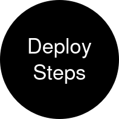

<div align="center">
  <a href="https://www.drupal.org/project/deploy_steps" rel="noopener">
  </a>
</div>

<h1 align="center">Deploy Steps</h1>

<div align="center">

[](https://github.com/AlexSkrypnyk/deploy_steps/issues)
[](https://github.com/AlexSkrypnyk/deploy_steps/pulls)
[](https://github.com/AlexSkrypnyk/deploy_steps/actions/workflows/test.yml)
[](https://codecov.io/gh/AlexSkrypnyk/deploy_steps)


</div>

---

Runs repeatable, run-on-every-deploy logic as discoverable **deploy step** plugins.

## Why this module exists

Drupal and Drush run-once hooks (`hook_update_N()`, `hook_post_update_NAME()`, `hook_deploy_NAME()`) are recorded as completed and never run again - they cannot express "run on every deploy". This module provides that missing layer: the repeatable counterpart to run-once `hook_deploy_NAME()`.

It owns the single pair of Drush `pre-command` / `post-command` hooks on `deploy:hook`, and on every deploy it **discovers** every `DeployStep` plugin from every enabled module, groups them by phase, orders each phase by weight, checks each plugin's skip reason, and runs the rest. Any enabled module contributes steps just by declaring a plugin - no Drush wiring of its own - which is what makes the mechanism reusable.

## Requirements

- Drupal `^10.3 || ^11`
- PHP `8.2+`
- [Drush](https://www.drush.org/) `^12.5 || ^13` - the module's entire integration is a pair of Drush command hooks

## Installation

```bash
composer require drupal/deploy_steps
drush pm:install deploy_steps
```

To enable the bundled example steps (see below):

```bash
drush pm:install deploy_steps_example
```

## How it runs

The module hooks `drush deploy:hook` - the command a deploy pipeline runs in every environment to apply pending database updates and configuration. Pre-phase steps run before the `deploy:hook` body, post-phase steps after it.

If a site's deploy pipeline does **not** call `drush deploy:hook`, the steps do not fire. Wire `drush deploy:hook` (typically via `drush deploy`) into your deploy process to use this module.

## Adding a deploy step

Create a plugin in any enabled module's `src/Plugin/DeployStep/` namespace:

```php
namespace Drupal\my_module\Plugin\DeployStep;

use Drupal\Core\StringTranslation\TranslatableMarkup;
use Drupal\deploy_steps\Attribute\DeployStep;
use Drupal\deploy_steps\DeployStepBase;
use Drupal\deploy_steps\DeployStepInterface;
use Drupal\deploy_steps\EnvironmentTrait;

#[DeployStep(
  id: 'rebuild_search_index',
  label: new TranslatableMarkup('Rebuild the search index'),
  weight: 10,
  phase: DeployStepInterface::PHASE_POST,
)]
final class RebuildSearchIndex extends DeployStepBase {

  // Opt in to the environment() helper used by skip() below.
  use EnvironmentTrait;

  // Return NULL to run, or a human-readable reason to skip (logged verbatim).
  public function skip(): ?string {
    return $this->environment() === 'prod' ? 'production environment' : NULL;
  }

  public function run(): void {
    // Idempotent work - it runs on every deploy.
  }

}
```

- **`weight`** sets the run order within the phase (lower runs first).
- **`phase`** chooses when the step runs: `PHASE_PRE` (before the `deploy:hook` body) or `PHASE_POST` (after it, the default).
- **`skip()`** decides whether the step runs. Returning a *reason* instead of a bare boolean means every skip is explicit and explained in the deploy log. The `environment()` helper from `EnvironmentTrait` (composed with `use`) covers the common case - compare it to your environment marker, e.g. `=== 'prod'`.
- **`run()`** is the step. It must be idempotent; throw to abort the deploy.
- Common services are injected on every step - use `$this->moduleHandler`, `$this->state`, `$this->entityTypeManager`, and `$this->configFactory` directly, no boilerplate. For any other service, override `create()`, call `parent::create()`, and assign it.

A single module can declare as many steps as it needs - each is its own plugin with its own ID.

### Long-running and memory-bound work

`DrushTrait` provides a `drush()` helper for heavy work (migrations, source-DB import, bulk reindex); a step composes it with `use`. It runs the given Drush sub-command in its own process - a fresh memory ceiling and bootstrap, output streamed to the deploy log, no timeout, and a non-zero exit throws to abort the deploy. Commands that build a Drupal batch (`migrate:import`, `search-api:index`) are then processed by Drush across subprocesses that restart as memory fills up, the same way a sandboxed `hook_update_N()` is re-entered.

### Running an external command

`ExecTrait` provides an `exec()` helper for shelling out to a non-Drush program; a step composes it with `use`. It runs the command through Symfony's `Process` - streaming output to the deploy log, and throwing on a non-zero exit to abort the deploy. The signature is `exec(string $command, array $arguments = [], array $inputs = [], array $env = [], int $timeout = 60, int $idle_timeout = 30)`; pass `0` for either timeout to disable it on long-running work.

### The environment convention

`environment()` reads `$settings['environment']` (set in `settings.php`); it lives in `EnvironmentTrait`, which a step composes with `use`. Compare it against your environment marker - e.g. `$this->environment() === 'prod'` - to gate a step. The module does not hardcode any project-specific environment names.

### Reading environment variables

`EnvTrait` provides an `env($name, $default)` helper for steps configured by environment variables the deploy pipeline exports; a step composes it with `use`. `ImportMigrationsDeployStep` reads `DRUPAL_MIGRATION_*` variables this way to skip itself and shape the import. This is distinct from `environment()` above - that reads the Drupal environment marker from `settings.php`, while `env()` reads a raw shell environment variable.

### Testing a deploy step

A step that calls `drush()` or `exec()` can be unit tested without a real Drush or process: mock that one method on the step (declare the step non-`final` so it can be mocked) and assert the command it would run.

```php
$step = $this->getMockBuilder(RunExternalCommandDeployStep::class)
  ->setConstructorArgs([[], 'run_external_command', []])
  ->onlyMethods(['exec'])
  ->getMock();
$step->expects($this->once())->method('exec')->with('/path/to/script');
$step->run();
```

The `deploy_steps_example` submodule ships a unit test for each of its steps - `ImportMigrationsDeployStepTest`, `ReindexSearchApiDeployStepTest`, and `RunExternalCommandDeployStepTest` - as patterns to copy.

## Example submodule

The optional `deploy_steps_example` submodule demonstrates the patterns - enable it to study, then model your own steps and their unit tests on its three steps. Each step skips itself when its prerequisite is missing, so enabling the module never breaks a deploy on its own:

- `ImportMigrationsDeployStep` redispatches `migrate:import`, shaped by `DRUPAL_MIGRATION_*` environment variables the deploy pipeline exports (skipped via `DRUPAL_MIGRATION_SKIP=1`, or when the `migrate_tools` module is absent).
- `ReindexSearchApiDeployStep` redispatches `search-api:index` (skipped unless the `search_api` module is enabled).
- `RunExternalCommandDeployStep` runs an external program via `ExecTrait`, and gates itself on the environment via `EnvironmentTrait` (skipped on the `local` environment, or when `$settings['deploy_steps_example_command']` is unset or missing).

`ImportMigrationsDeployStep` and `ReindexSearchApiDeployStep` show the bulk-work pattern - each redispatched command builds a Drupal batch that Drush processes across restarting subprocesses (see [Long-running and memory-bound work](#long-running-and-memory-bound-work) above). `ReindexSearchApiDeployStep` uses `search_api`, listed under `suggest`. `ImportMigrationsDeployStep` uses `migrate_tools`, which needs `migrate_plus` to enable:

```bash
composer require drupal/search_api
composer require drupal/migrate_tools drupal/migrate_plus
```

`RunExternalCommandDeployStep` shells out to a non-Drush program with `ExecTrait` (preferred over a raw `shell_exec()` because it streams output and throws on a non-zero exit). Point the setting at an executable to enable it:

```php
// settings.php
$settings['deploy_steps_example_command'] = '/path/to/post-deploy.sh';
```

## Local development

1. Install PHP with SQLite support and Composer
2. Clone this repository
3. Run `make build` or `ahoy build`

## Building website

`make build` or `ahoy build` assembles the codebase, starts the PHP server
and provisions the Drupal website with this extension enabled. These operations
are executed using scripts within [`.devtools`](.devtools) directory. CI uses
the same scripts to build and test this extension.

The resulting codebase is then placed in the `build` directory. The extension
files are symlinked into the Drupal site structure.

The `build` command is a wrapper for more granular commands:
```bash
make assemble     # Assemble the codebase
make start        # Start the PHP server
make provision    # Provision the Drupal website

ahoy assemble     # Assemble the codebase
ahoy start        # Start the PHP server
ahoy provision    # Provision the Drupal website
```

The `provision` command is useful for re-installing the Drupal website without
re-assembling the codebase.

### Drupal versions

The Drupal version used for the codebase assembly is determined by the
`DRUPAL_VERSION` variable and defaults to the latest stable version.

You can specify a different version by setting the `DRUPAL_VERSION` environment
variable before running the `make build` or `ahoy build` command:

```bash
DRUPAL_VERSION=11 make build        # Drupal 11
DRUPAL_VERSION=11@alpha make build  # Drupal 11 alpha
DRUPAL_VERSION=10@beta make build   # Drupal 10 beta
DRUPAL_VERSION=11.1 make build      # Drupal 11.1
```

The `minimum-stability` setting in the `composer.json` file is
automatically adjusted to match the specified Drupal version's stability.

### Patching dependencies

To apply patches to the dependencies, add a patch to the `patches` section of
`composer.json`. Local patches are sourced from the `patches` directory.

### Providing `GITHUB_TOKEN`

To overcome GitHub API rate limits, you may provide a `GITHUB_TOKEN` environment
variable with a personal access token.

### Provisioning the website

The `provision` command installs the Drupal website from the `standard`
profile with the extension (and any `suggest`'ed extensions) enabled. The
profile can be changed by setting the `DRUPAL_PROFILE` environment variable.

The website will be available at http://localhost:8000 by default. The
hostname can be changed by setting the `WEBSERVER_HOST` environment variable.

The `WEBSERVER_PORT` is resolved with the following precedence:

1. **`WEBSERVER_PORT` exported in the shell** - used as-is. Useful for one-off
   runs: `WEBSERVER_PORT=9000 make build`.
2. **`WEBSERVER_PORT` line in the project-root `.env` file** - used as-is.
   The `start` script does not modify `.env` when this entry is already
   present, so the same port is reused across `start`, `stop`, `provision`,
   `drush` and `login` commands.
3. **Neither is set** - the `start` script discovers the first free port in
   the range `8000-8099` and writes it to `.env` as `WEBSERVER_PORT=NNNN`.
   Subsequent commands read this value from `.env`.

To force re-discovery, delete `.env` (or just the `WEBSERVER_PORT` line in
it) and re-run `make start` / `ahoy start`.

An SQLite database is created in `/tmp/site_deploy_steps.sqlite` file.
You can browse the contents of the created SQLite database using
[DB Browser for SQLite](https://sqlitebrowser.org/).

A one-time login link will be printed to the console.

### Step-debugging with XDebug

PHP step-debugging is supported via [XDebug](https://xdebug.org/docs/install). Install the XDebug PHP extension on your host (`php -v` should mention `with Xdebug`), then toggle it on the development server:

```bash
make debug      # restart with XDebug enabled (aliases: debug-on, xdebug, xdebug-on)
ahoy debug      # same, with ahoy

make start      # restart without XDebug (aliases: debug-off, xdebug-off)
ahoy start      # same, with ahoy
```

The `debug` command probes the running PHP server's command line for `xdebug.mode=debug` and skips the restart if XDebug is already enabled. Code coverage stays on [pcov](https://github.com/krakjoe/pcov) because `xdebug.mode=debug` does not include `coverage`.

To start and stop debug sessions from the browser, install the Xdebug Helper extension: [Chrome](https://chromewebstore.google.com/detail/xdebug-helper-by-jetbrain/aoelhdemabeimdhedkidlnbkfhnhgnhm) / [Firefox](https://addons.mozilla.org/en-US/firefox/addon/xdebug-helper-by-jetbrains/).

## Coding standards

The `make lint` or `ahoy lint` command checks the codebase using multiple
tools:
- PHP code standards checking against `Drupal` and `DrupalPractice` standards.
- PHP code static analysis with PHPStan.
- PHP deprecated code analysis and auto-fixing with Drupal Rector.
- Twig code analysis with Twig CS Fixer.

The configuration files for these tools are located in the root of the codebase.

### Fixing coding standards issues

To fix coding standards issues automatically, run the `make lint-fix` or
`ahoy lint-fix`. This runs the same tools as `lint` command but with the
`--fix` option (for the tools that support it).

## Testing

The `make test` or `ahoy test` command runs the tests for this extension.

The tests are located in the `tests/src` directory. The `phpunit.xml` file
configures PHPUnit to run the tests. It uses Drupal core's bootstrap file
`core/tests/bootstrap.php` to bootstrap the Drupal environment before running
the tests.

The `test` command is a wrapper for multiple test commands:
```bash
make test-unit                    # Run Unit tests
make test-kernel                  # Run Kernel tests
make test-functional              # Run Functional tests

ahoy test-unit                    # Run Unit tests
ahoy test-kernel                  # Run Kernel tests
ahoy test-functional              # Run Functional tests
```

### Running specific tests

You can run specific tests by passing a path to the test file or PHPUnit CLI
option (`--filter`, `--group`, etc.) to the `make test` or `ahoy test` command:

```bash
make test-unit tests/src/Unit/MyUnitTest.php
make test-unit -- --group=wip

ahoy test-unit tests/src/Unit/MyUnitTest.php
ahoy test-unit -- --group=wip
```

You may also run tests using the `phpunit` command directly:

```bash
cd build
php -d pcov.directory=.. vendor/bin/phpunit tests/src/Unit/MyUnitTest.php
php -d pcov.directory=.. vendor/bin/phpunit --group=wip
```

---
_This repository was created using the [Drupal Extension Scaffold](https://github.com/AlexSkrypnyk/drupal_extension_scaffold) project template_
