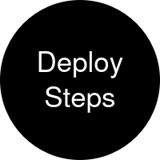

<div align="center">
  <a href="https://www.drupal.org/project/deploy_steps" rel="noopener">
  </a>
</div>

<h1 align="center">Deploy Steps</h1>

<div align="center">

[](https://github.com/AlexSkrypnyk/deploy_steps/issues)
[](https://github.com/AlexSkrypnyk/deploy_steps/pulls)
[](https://github.com/AlexSkrypnyk/deploy_steps/actions/workflows/test.yml)
[](https://codecov.io/gh/AlexSkrypnyk/deploy_steps)


</div>

---

Runs repeatable, run-on-every-deploy logic as discoverable **deploy step** plugins.

## Why this module exists

Drupal and Drush run-once hooks (`hook_update_N()`, `hook_post_update_NAME()`, `hook_deploy_NAME()`) are recorded as completed and never run again - they cannot express "run on every deploy". This module provides that missing layer: the repeatable counterpart to run-once `hook_deploy_NAME()`.

It owns the single pair of Drush `pre-command` / `post-command` hooks on `deploy:hook`, and on every deploy it **discovers** every `DeployStep` plugin from every enabled module, groups them by phase, orders each phase by weight, checks each plugin's skip reason, and runs the rest. Any enabled module contributes steps just by declaring a plugin - no Drush wiring of its own - which is what makes the mechanism reusable.

## Requirements

- Drupal `^10.3 || ^11`
- PHP `8.3+`
- [Drush](https://www.drush.org/) `^12.5 || ^13` - the module's entire integration is a pair of Drush command hooks

## Installation

```bash
composer require drupal/deploy_steps
drush pm:install deploy_steps
```

To enable the bundled example steps (see below):

```bash
drush pm:install deploy_steps_example
```

## How it runs

The module hooks `drush deploy:hook` - the command a deploy pipeline runs in every environment to apply pending database updates and configuration. Pre-phase steps run before the `deploy:hook` body, post-phase steps after it.

If a site's deploy pipeline does **not** call `drush deploy:hook`, the steps do not fire. Wire `drush deploy:hook` (typically via `drush deploy`) into your deploy process to use this module.

## Adding a deploy step

Create a plugin in any enabled module's `src/Plugin/DeployStep/` namespace:

```php
namespace Drupal\my_module\Plugin\DeployStep;

use Drupal\Core\StringTranslation\TranslatableMarkup;
use Drupal\deploy_steps\Attribute\DeployStep;
use Drupal\deploy_steps\DeployStepBase;
use Drupal\deploy_steps\DeployStepInterface;
use Drupal\deploy_steps\EnvironmentTrait;

#[DeployStep(
  id: 'rebuild_search_index',
  label: new TranslatableMarkup('Rebuild the search index'),
  weight: 10,
  phase: DeployStepInterface::PHASE_POST,
)]
final class RebuildSearchIndex extends DeployStepBase {

  // Opt in to the environment() helper used by skip() below.
  use EnvironmentTrait;

  // Return NULL to run, or a human-readable reason to skip (logged verbatim).
  public function skip(): ?string {
    return $this->environment() === 'prod' ? 'production environment' : NULL;
  }

  public function run(): void {
    // Idempotent work - it runs on every deploy.
  }

}
```

- **`weight`** sets the run order within the phase (lower runs first).
- **`phase`** chooses when the step runs: `PHASE_PRE` (before the `deploy:hook` body) or `PHASE_POST` (after it, the default).
- **`skip()`** decides whether the step runs. Returning a *reason* instead of a bare boolean means every skip is explicit and explained in the deploy log. The `environment()` helper from `EnvironmentTrait` (composed with `use`) covers the common case - compare it to your environment marker, e.g. `=== 'prod'`.
- **`run()`** is the step. It must be idempotent; throw to abort the deploy.
- Common services are injected on every step - use `$this->moduleHandler`, `$this->state`, `$this->entityTypeManager`, and `$this->configFactory` directly, no boilerplate. For any other service, override `create()`, call `parent::create()`, and assign it.

A single module can declare as many steps as it needs - each is its own plugin with its own ID.

### Long-running and memory-bound work

`DrushTrait` provides a `drush()` helper for heavy work (migrations, source-DB import, bulk reindex); a step composes it with `use`. It runs the given Drush sub-command in its own process - a fresh memory ceiling and bootstrap, output streamed to the deploy log, no timeout, and a non-zero exit throws to abort the deploy. Commands that build a Drupal batch (`migrate:import`, `search-api:index`) are then processed by Drush across subprocesses that restart as memory fills up, the same way a sandboxed `hook_update_N()` is re-entered.

### Running an external command

`ExecTrait` provides an `exec()` helper for shelling out to a non-Drush program; a step composes it with `use`. It runs the command through Symfony's `Process` - streaming output to the deploy log, and throwing on a non-zero exit to abort the deploy. The signature is `exec(string $command, array $arguments = [], array $inputs = [], array $env = [], int $timeout = 60, int $idle_timeout = 30)`; pass `0` for either timeout to disable it on long-running work.

### The environment convention

`environment()` reads `$settings['environment']` (set in `settings.php`); it lives in `EnvironmentTrait`, which a step composes with `use`. Compare it against your environment marker - e.g. `$this->environment() === 'prod'` - to gate a step. The module does not hardcode any project-specific environment names.

### Reading environment variables

`EnvTrait` provides an `env($name, $default)` helper for steps configured by environment variables the deploy pipeline exports; a step composes it with `use`. `ImportMigrationsDeployStep` reads `DRUPAL_MIGRATION_*` variables this way to skip itself and shape the import. This is distinct from `environment()` above - that reads the Drupal environment marker from `settings.php`, while `env()` reads a raw shell environment variable.

### Testing a deploy step

A step that calls `drush()` or `exec()` can be unit tested without a real Drush or process: mock that one method on the step (declare the step non-`final` so it can be mocked) and assert the command it would run.

```php
$step = $this->getMockBuilder(RunExternalCommandDeployStep::class)
  ->setConstructorArgs([[], 'run_external_command', []])
  ->onlyMethods(['exec'])
  ->getMock();
$step->expects($this->once())->method('exec')->with('/path/to/script');
$step->run();
```

The `deploy_steps_example` submodule ships a unit test for each of its steps - `ImportMigrationsDeployStepTest`, `ReindexSearchApiDeployStepTest`, and `RunExternalCommandDeployStepTest` - as patterns to copy.

## Example submodule

The optional `deploy_steps_example` submodule demonstrates the patterns - enable it to study, then model your own steps and their unit tests on its three steps. Each step skips itself when its prerequisite is missing, so enabling the module never breaks a deploy on its own:

- `ImportMigrationsDeployStep` redispatches `migrate:import`, shaped by `DRUPAL_MIGRATION_*` environment variables the deploy pipeline exports (skipped via `DRUPAL_MIGRATION_SKIP=1`, or when the `migrate_tools` module is absent).
- `ReindexSearchApiDeployStep` redispatches `search-api:index` (skipped unless the `search_api` module is enabled).
- `RunExternalCommandDeployStep` runs an external program via `ExecTrait`, and gates itself on the environment via `EnvironmentTrait` (skipped on the `local` environment, or when `$settings['deploy_steps_example_command']` is unset or missing).

`ImportMigrationsDeployStep` and `ReindexSearchApiDeployStep` show the bulk-work pattern - each redispatched command builds a Drupal batch that Drush processes across restarting subprocesses (see [Long-running and memory-bound work](#long-running-and-memory-bound-work) above). `ReindexSearchApiDeployStep` uses `search_api`, listed under `suggest`. `ImportMigrationsDeployStep` uses `migrate_tools`, which needs `migrate_plus` to enable:

```bash
composer require drupal/search_api
composer require drupal/migrate_tools drupal/migrate_plus
```

`RunExternalCommandDeployStep` shells out to a non-Drush program with `ExecTrait` (preferred over a raw `shell_exec()` because it streams output and throws on a non-zero exit). Point the setting at an executable to enable it:

```php
// settings.php
$settings['deploy_steps_example_command'] = '/path/to/post-deploy.sh';
```

## Contributing

See [CONTRIBUTING.md](CONTRIBUTING.md) for local development, building the
site, checking coding standards, and running the tests.

---
_This repository was created using the [Drupal Extension Scaffold](https://github.com/AlexSkrypnyk/drupal_extension_scaffold) project template_
