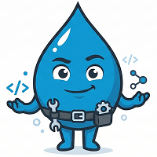

<div align="center">
  <a href="" rel="noopener">
  </a>
</div>

<h1 align="center">Helper utilities for Drupal</h1>

<div align="center">

[](https://github.com/AlexSkrypnyk/drupal_helpers/issues)
[](https://github.com/AlexSkrypnyk/drupal_helpers/pulls)
[](https://github.com/AlexSkrypnyk/drupal_helpers/actions/workflows/test.yml)
[](https://codecov.io/gh/AlexSkrypnyk/drupal_helpers)


</div>

---

## Features

<details>
  <summary>🎯 <strong>Static facade for clean deploy hooks</strong></summary>

Access all helpers through `Helper::term()`, `Helper::config()`, etc. — no
need to inject services or know container names. One `use` statement is all
you need.

```php
use Drupal\drupal_helpers\Helper;

Helper::term()->createTree('tags', ['News', 'Events', 'Blog']);
Helper::config()->set('system.site', 'name', 'My Site');
```

</details>

<details>
  <summary>⚡ <strong>Batch processing for large datasets</strong></summary>

Pass the `$sandbox` array from your deploy hook and the helper automatically
batches operations across multiple requests — no manual tracking of
`$sandbox['#finished']`.

```php
function my_module_deploy_001(array &$sandbox): ?string {
  return Helper::entity($sandbox)->deleteAll('node', 'article');
}
```

</details>

<details>
  <summary>🧰 <strong>Taxonomy, menu, field, entity, config, user, and redirect helpers</strong></summary>

Common deploy hook operations covered out of the box:
- Create taxonomy term trees (flat or nested) with duplicate detection.
- Build menu link hierarchies from arrays.
- Delete fields and field instances with automatic data purging.
- Import config YAML from modules.
- Create users with roles and auto-generated passwords.
- Create, import (CSV), and clean up redirects.

</details>

<details>
  <summary>🔌 <strong>Extendable via Drupal services</strong></summary>

Every helper is a standard Drupal service registered in
`drupal_helpers.services.yml`. You can override, decorate, or inject them
into your own services using Drupal's dependency injection container.

```yaml
# Use a helper as a dependency in your own service:
services:
  my_module.migrator:
    class: Drupal\my_module\Migrator
    arguments: ['@drupal_helpers.term', '@drupal_helpers.entity']
```

</details>

<details>
  <summary>🛡️ <strong>Module requirement checking</strong></summary>

Helpers that depend on contrib modules (e.g., Redirect requires the `redirect`
module) declare their requirements via `requiredModules()`. The facade checks
these at access time and throws a clear error if a module is missing — no
cryptic "service not found" exceptions.

</details>

## Usage

All helpers are accessed via the `Helper` facade:

```php
use Drupal\drupal_helpers\Helper;

// Simple — no sandbox:
Helper::term()->createTree('topics', $tree);
Helper::field()->delete('field_old');

// Batched — with sandbox:
function my_module_deploy_001(array &$sandbox): ?string {
  return Helper::entity($sandbox)->deleteAll('node', 'article');
}
```

## Available methods

| Helper | Description |
| --- | --- |
| [Config](#config) | Configuration helpers for deploy hooks. |
| [Entity](#entity) | Entity helpers for deploy hooks. |
| [Field](#field) | Field helpers for deploy hooks. |
| [Menu](#menu) | Menu link helpers for deploy hooks. |
| [Redirect](#redirect) | Redirect helpers for deploy hooks. |
| [Term](#term) | Taxonomy term helpers for deploy hooks. |
| [User](#user) | User helpers for deploy hooks. |

---

### Config

[Source](src/Helpers/Config.php)

>  Configuration helpers for deploy hooks.

<details>
  <summary>Set a value in a configuration object.<br/><code>set(string $config_name, string $key, mixed $value): void</code></summary>

```php
Helper::config()->set('system.site', 'name', 'My Site');
```

</details>

<details>
  <summary>Get a value from a configuration object.<br/><code>get(string $config_name, string $key): mixed</code></summary>

```php
$site_name = Helper::config()->get('system.site', 'name');
```

</details>

<details>
  <summary>Delete a configuration object.<br/><code>delete(string $config_name): void</code></summary>

```php
Helper::config()->delete('my_module.settings');
```

</details>

<details>
  <summary>Import a config from a module's config/install directory.<br/><code>import(string $module_name, string $config_name, string $subdirectory = 'install'): void</code></summary>

```php
Helper::config()->import('my_module', 'views.view.my_view');
Helper::config()->import('my_module', 'node.type.page', 'optional');
```

</details>

<details>
  <summary>Import multiple configs from a module.<br/><code>importMultiple(string $module_name, array $config_names, string $subdirectory = 'install'): void</code></summary>

```php
Helper::config()->importMultiple('my_module', [
  'views.view.my_view',
  'field.storage.node.field_custom',
]);
```

</details>

<details>
  <summary>Set the site front page.<br/><code>setFrontPage(string $path): void</code></summary>

```php
Helper::config()->setFrontPage('/node/1');
```

</details>


### Entity

[Source](src/Helpers/Entity.php)

>  Entity helpers for deploy hooks.

<details>
  <summary>Delete all entities of a given type and optional bundle.<br/><code>deleteAll(string $entity_type, ?string $bundle = NULL): ?string</code></summary>

```php
Helper::entity()->deleteAll('node', 'article');

// With sandbox for large datasets:
function my_module_deploy_001(array &$sandbox): ?string {
  return Helper::entity($sandbox)->deleteAll('node', 'article');
}
```

</details>


### Field

[Source](src/Helpers/Field.php)

>  Field helpers for deploy hooks.

<details>
  <summary>Delete a field from all entity bundles and purge its data.<br/><code>delete(string $field_name): void</code></summary>

```php
Helper::field()->delete('field_subtitle');
```

</details>

<details>
  <summary>Delete a field instance from a specific entity bundle.<br/><code>deleteInstance(string $field_name, string $entity_type, string $bundle): void</code></summary>

```php
Helper::field()->deleteInstance('field_subtitle', 'node', 'article');
```

</details>


### Menu

[Source](src/Helpers/Menu.php)

>  Menu link helpers for deploy hooks.

<details>
  <summary>Create menu links from a nested tree structure.<br/><code>createTree(string $menu_name, array $tree, ?string $parent_id = NULL): array</code></summary>

```php
$tree = [
  'Home' => '/',
  'About' => [
    'path' => '/about',
    'children' => [
      'Team' => '/about/team',
      'Contact' => '/about/contact',
    ],
  ],
  'External' => 'https://example.com',
];
Helper::menu()->createTree('main', $tree);
```

</details>

<details>
  <summary>Delete all menu links from a menu.<br/><code>deleteTree(string $menu_name): ?string</code></summary>

```php
Helper::menu()->deleteTree('main');
```

</details>

<details>
  <summary>Find a menu link by properties.<br/><code>findItem(string $menu_name, array $properties): ?MenuLinkContentInterface</code></summary>

```php
$link = Helper::menu()->findItem('main', ['title' => 'About']);
```

</details>

<details>
  <summary>Update properties on an existing menu link found by properties.<br/><code>updateItem(string $menu_name, array $find_properties, array $updates): ?MenuLinkContentInterface</code></summary>

```php
Helper::menu()->updateItem('main', ['title' => 'About'], [
  'path' => '/about-us',
  'weight' => 5,
]);
```

</details>


### Redirect

[Source](src/Helpers/Redirect.php)

>  Redirect helpers for deploy hooks.

<details>
  <summary>Create a redirect.<br/><code>create(string $source_path, string $redirect_path, int $status_code = 301, bool $skip_existing = TRUE): mixed</code></summary>

```php
Helper::redirect()->create('old-page', '/new-page');
Helper::redirect()->create('legacy', 'https://example.com', 302);
```

</details>

<details>
  <summary>Create multiple redirects.<br/><code>createMultiple(array $redirects): int</code></summary>

```php
Helper::redirect()->createMultiple([
  ['source' => 'old-page', 'target' => '/new-page'],
  ['source' => 'legacy', 'target' => 'https://example.com', 'status_code' => 302],
]);
```

</details>

<details>
  <summary>Delete redirects by source path.<br/><code>deleteBySource(string $source_path): int</code></summary>

```php
Helper::redirect()->deleteBySource('old-page');
```

</details>

<details>
  <summary>Delete all redirect entities.<br/><code>deleteAll(): ?string</code></summary>

```php
Helper::redirect()->deleteAll();
```

</details>

<details>
  <summary>Import redirects from a CSV file.<br/><code>importFromCsv(string $file_path): ?string</code></summary>

```php
Helper::redirect()->importFromCsv('/path/to/redirects.csv');

// With sandbox for large files:
function my_module_deploy_001(array &$sandbox): ?string {
  return Helper::redirect($sandbox)->importFromCsv('/path/to/redirects.csv');
}
```

</details>


### Term

[Source](src/Helpers/Term.php)

>  Taxonomy term helpers for deploy hooks.

<details>
  <summary>Create terms from a nested tree structure.<br/><code>createTree(string $vocabulary, array $tree, bool $preserve_existing = TRUE, int $parent_tid = 0): array</code></summary>

```php
// Flat list:
Helper::term()->createTree('tags', ['News', 'Events', 'Blog']);

// Nested hierarchy:
Helper::term()->createTree('topics', [
  'Finance' => [
    'Budgets',
    'Grants',
  ],
  'Governance' => [
    'Policy' => [
      'Internal',
      'External',
    ],
    'Compliance',
  ],
  'Operations',
]);
```

</details>

<details>
  <summary>Delete all terms from a vocabulary.<br/><code>deleteAll(string $vocabulary): ?string</code></summary>

```php
Helper::term()->deleteAll('tags');
```

</details>

<details>
  <summary>Find a term by name in a vocabulary.<br/><code>find(string $name, ?string $vocabulary = NULL): ?TermInterface</code></summary>

```php
$term = Helper::term()->find('News', 'tags');
```

</details>


### User

[Source](src/Helpers/User.php)

>  User helpers for deploy hooks.

<details>
  <summary>Create a user account.<br/><code>create(string $email, array $roles = [], array $fields = []): UserInterface</code></summary>

```php
Helper::user()->create('admin@example.com', ['administrator']);
Helper::user()->create('editor@example.com', ['editor'], [
  'name' => 'editor1',
  'status' => 1,
]);
```

</details>

<details>
  <summary>Create multiple user accounts.<br/><code>createMultiple(array $emails, array $roles = [], array $fields = []): array</code></summary>

```php
Helper::user()->createMultiple([
  'user1@example.com',
  'user2@example.com',
], ['editor']);
```

</details>

<details>
  <summary>Assign roles to an existing user.<br/><code>assignRoles(string $user_identifier, array $roles): void</code></summary>

```php
Helper::user()->assignRoles('admin@example.com', ['administrator']);
```

</details>

<details>
  <summary>Remove roles from an existing user.<br/><code>removeRoles(string $user_identifier, array $roles): void</code></summary>

```php
Helper::user()->removeRoles('admin@example.com', ['administrator']);
```

</details>


[//]: # (END)

## Maintenance

### Local development

1. Install PHP with SQLite support and Composer
3. Clone this repository
4. Run `ahoy build`

### Building website

`ahoy build` assembles the codebase, starts the PHP server and provisions the
Drupal website with this extension enabled. These operations are executed using
scripts within [`.devtools`](.devtools) directory. CI uses the same scripts to
build and test this extension.

The resulting codebase is then placed in the `build` directory. The extension
files are symlinked into the Drupal site structure.

The `build` command is a wrapper for more granular commands:
```bash
ahoy assemble     # Assemble the codebase
ahoy start        # Start the PHP server
ahoy provision    # Provision the Drupal website
```

The `provision` command is useful for re-installing the Drupal website without
re-assembling the codebase.

#### Drupal versions

The Drupal version used for the codebase assembly is determined by the
`DRUPAL_VERSION` variable and defaults to the latest stable version.

You can specify a different version by setting the `DRUPAL_VERSION` environment
variable before running the `ahoy build` command:

```bash
DRUPAL_VERSION=11 ahoy build        # Drupal 11
DRUPAL_VERSION=11@alpha ahoy build  # Drupal 11 alpha
DRUPAL_VERSION=10@beta ahoy build   # Drupal 10 beta
DRUPAL_VERSION=11.1 ahoy build      # Drupal 11.1
```

The `minimum-stability` setting in the `composer.json` file is
automatically adjusted to match the specified Drupal version's stability.

#### Provisioning the website

The `provision` command installs the Drupal website from the `standard`
profile with the extension (and any `suggest`'ed extensions) enabled. The
profile can be changed by setting the `DRUPAL_PROFILE` environment variable.

The website will be available at http://localhost:8000. The hostname and port
can be changed by setting the `WEBSERVER_HOST` and `WEBSERVER_PORT` environment
variables.

An SQLite database is created in `/tmp/site_drupal_helpers.sqlite` file.
You can browse the contents of the created SQLite database using
[DB Browser for SQLite](https://sqlitebrowser.org/).

A one-time login link will be printed to the console.

### Coding standards

The `ahoy lint` command checks the codebase using multiple tools:
- PHP code standards checking against `Drupal` and `DrupalPractice` standards.
- PHP code static analysis with PHPStan.
- PHP deprecated code analysis and auto-fixing with Drupal Rector.
- JavaScript code analysis with ESLint.
- CSS code analysis with Stylelint.

The configuration files for these tools are located in the root of the codebase.

#### Fixing coding standards issues

To fix coding standards issues automatically, run `ahoy lint-fix`. This runs
the same tools as `lint` command but with the `--fix` option (for the tools
that support it).

### Testing

The `ahoy test` command runs the PHPUnit tests for this extension.

The tests are located in the `tests/src` directory. The `phpunit.xml` file
configures PHPUnit to run the tests. It uses Drupal core's bootstrap file
`core/tests/bootstrap.php` to bootstrap the Drupal environment before running
the tests.

The `test` command is a wrapper for multiple test commands:
```bash
ahoy test-unit                    # Run Unit tests
ahoy test-kernel                  # Run Kernel tests
ahoy test-functional              # Run Functional tests
```

#### Running specific tests

You can run specific tests by passing a path to the test file or PHPUnit CLI
option (`--filter`, `--group`, etc.) to the `ahoy test` command:

```bash
ahoy test-unit tests/src/Unit/MyUnitTest.php
ahoy test-unit -- --group=wip
```

You may also run tests using the `phpunit` command directly:

```bash
cd build
php -d pcov.directory=.. vendor/bin/phpunit tests/src/Unit/MyUnitTest.php
php -d pcov.directory=.. vendor/bin/phpunit --group=wip
```

---
_This repository was created using the [Drupal Extension Scaffold](https://github.com/AlexSkrypnyk/drupal_extension_scaffold) project template_
